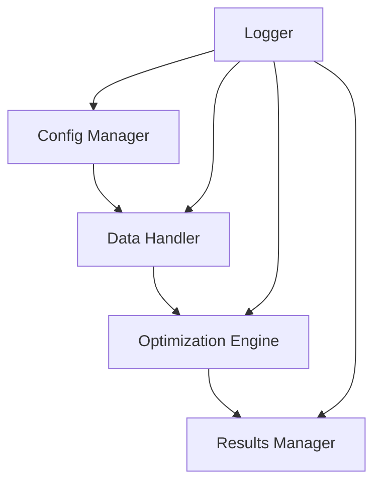

# Hyperopter

[](https://www.python.org/downloads/)
[](https://github.com/psf/black)

## Overview

Hyperopter is a sophisticated hyperparameter optimization pipeline designed for trading strategies. It automates the process of finding optimal parameters for trading strategies through a modular, efficient, and scalable architecture.

### Key Features

- 🚀 Automated hyperparameter optimization for trading strategies
- 📊 CSV-based data handling with comprehensive validation
- ⚙️ JSON-based configuration management
- 🔄 Designed with CI/CD strategy pipelines in mind
- 📈 Performance metrics and visualization
- 🛠 Modular and extensible architecture

### Current Status

Current Version: 1.0.0 (Development Phase)

## Quick Start

### Prerequisites

```bash
- Python 3.8 or higher
- poetry (package manager)
- Git
```

### Installation

```bash
# Clone the repository
git clone https://github.com/yourusername/hyperopt-trade.git
cd hyperopt-trade

# Create and activate virtual environment
python -m venv venv
source venv/bin/activate  # On Windows: .\venv\Scripts\activate

# Install dependencies
pip install -r requirements.txt
```

### Basic Usage

1. Configure your strategy:
```json
{
    "strategy_name": "example_strategy",
    "parameters": {
        "moving_average_period": {
            "type": "integer",
            "range": [5, 200],
            "step": 1
        }
    },
    "optimization": {
        "method": "TPE",
        "trials": 100,
        "timeout": 3600
    }
}
```

2. Run optimization:
```bash
python -m hyperopt_trade optimize --config config.json --data data.csv
```

3. View results:
```bash
python -m hyperopt_trade results --output results.json
```

## Documentation

### Architecture Overview

The system consists of five core components:

1. **Configuration Manager**: Handles JSON configuration parsing and validation
2. **Data Handler**: Manages CSV data loading and preprocessing
3. **Optimization Engine**: Executes hyperparameter optimization
4. **Results Manager**: Generates and stores optimization results
5. **Logging System**: Provides comprehensive system logging



## Development

### Setup Development Environment

```bash
# Install development dependencies
pip install -r requirements-dev.txt

# Setup pre-commit hooks
pre-commit install

# Run tests
pytest tests/
```

### Testing

```bash
# Run unit tests
pytest tests/unit/

# Run integration tests
pytest tests/integration/

# Run with coverage
pytest --cov=src tests/
```

### Contributing Guidelines

1. Fork the repository
2. Create a feature branch
3. Write tests for new features
4. Ensure all tests pass
5. Submit a pull request

## Deployment

### Production Considerations

1. Memory Management
   - Monitor resource usage
   - Implement cleanup strategies
   - Set appropriate limits

2. Error Handling
   - Implement robust error handling
   - Set up monitoring alerts
   - Maintain error logs

3. Performance
   - Use parallel processing when possible
   - Implement caching strategies
   - Monitor optimization performance

## Support

### Issue Reporting

Please report issues via GitHub Issues, including:
- Clear description of the problem
- Steps to reproduce
- Expected vs actual behavior
- System information

### Contact

- Project Owner: Marwin Steiner
- Email: mailto:marwin.steiner@gmail.com
- GitHub: [@marwinsteiner](https://github.com/marwinsteiner)

---
Marwin Steiner, London, December 2024
