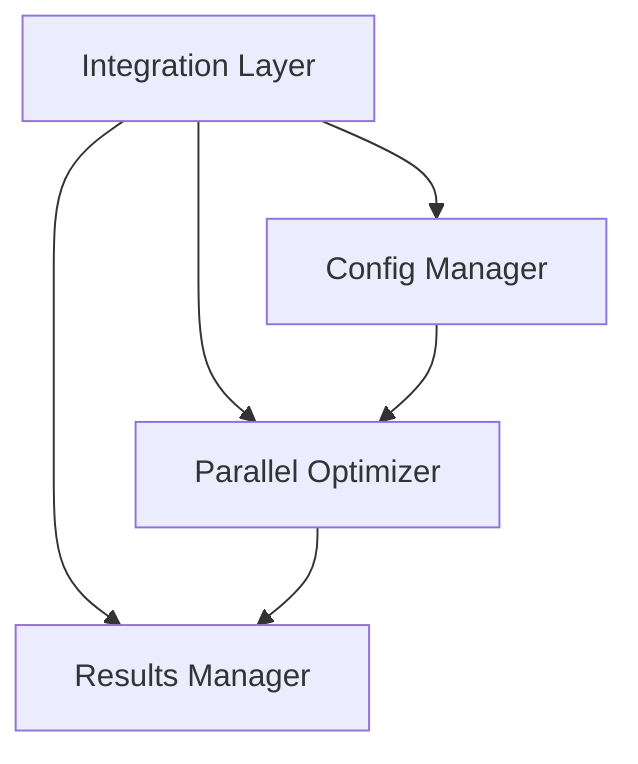

# Hyperopter

[](https://www.python.org/downloads/)
[](https://github.com/psf/black)

## Overview

Hyperopter is a sophisticated hyperparameter optimization framework designed for trading strategies. It provides a parallel, efficient, and modular architecture for finding optimal parameters that maximize strategy performance metrics like Sharpe ratio, or other loss functions. Hyperparameter optimization is primarily a tool for quant researchers, seeking alpha. This library can sit inside the CI/CD strategy pipeline of an algorithmic trading system, used in combination with other processes like backtesting or Montecarlo simulations to determine whether a particular strategy should be added to the "playbook" or whether it requires further refinement. 

The only way to avoid overfitting, is by the operator (you) using hyperopter correctly. If you hyperparameter optimize over your entire sample you're overfitting. Ideally, you use hyperopter on a small but significant subsample and apply the frozen parameters on a larger OOS backtest, which should only serve to develop conviction to begin with.

### Key Features

- 🚀 Parallel optimization with configurable workers and batch sizes
- 📊 Flexible strategy evaluation with customizable metrics
- ⚙️ JSON-based configuration for parameter spaces and optimization settings
- 🔄 Robust error handling and result management
- 📈 Comprehensive logging and result tracking
- 🛠 Modular architecture for easy extension

### Current Status

Current Version: 0.1.0 (Development Phase) - as soon as I have time I will implement further loss functions, to allow optimizing for highest Sharpe, highest PnL in period, highest Sortino, highest Calmar, lowest maximum drawdown, and so on. 

## Quick Start

### Prerequisites

```bash
Python 3.12 or higher
Required packages:
- pandas
- numpy
- scikit-learn
- loguru
- jsonschema
- pytest
- psutil
```

### Installation

```bash
# Clone the repository
git clone https://github.com/marwinsteiner/hyperopter.git
cd hyperopter

# Create and activate virtual environment
conda create -n [give it a name] python=[choose the correct python version, I use 3.12]
conda activate [the name you gave it]

poetry init  # click through the menus

# Install dependencies, see pyproject.toml
```

### Basic Usage

1. Create a configuration file (e.g., `moving_average_config.json`):
```json
{
    "parameter_space": {
        "fast_period": {
            "type": "int",
            "range": [2, 10],
            "step": 1
        },
        "slow_period": {
            "type": "int",
            "range": [5, 20],
            "step": 1
        }
    },
    "optimization_settings": {
        "max_iterations": 50,
        "convergence_threshold": 0.001,
        "parallel_trials": 4
    }
}
```

2. Implement your strategy evaluation function:
```python
def evaluate_strategy(data: pd.DataFrame, params: dict) -> float:
    # Your strategy logic here
    return performance_metric
```

3. Run optimization:
```python
from integration import create_optimizer

optimizer = create_optimizer(
    config_path="config.json",
    data_path="data.csv",
    strategy_evaluator=evaluate_strategy,
    output_dir="results"
)
optimizer.optimize()
```

## Architecture

The framework consists of four core components:

1. **Integration Layer**: Provides a clean interface for creating and running optimizations
2. **Parallel Optimizer**: Handles parallel execution of strategy evaluations
3. **Results Manager**: Manages optimization results and generates reports
4. **Configuration Manager**: Handles parameter space and optimization settings



## Examples

The repository includes a complete example of optimizing a moving average crossover strategy:

- `examples/optimize_moving_average.py`: Example strategy implementation
- `examples/data/sample_data.csv`: Sample price data
- `config/moving_average_config.json`: Example configuration

I also use this dummy strategy to write the tests. All system components should work the same regardless of what strategy is being hyperopted.

## Development

### Running Tests

```bash
# Run all tests
pytest tests/

# Run with coverage
pytest --cov=src tests/
```

### Contributing Guidelines

1. Fork the repository
2. Create a feature branch
3. Write tests for new features
4. Ensure all tests pass
5. Submit a pull request

## Support

### Issue Reporting

Please report issues via GitHub Issues, including:
- Clear description of the problem
- Steps to reproduce
- Expected vs actual behavior
- System information

### Contact

- Project Owner: Marwin Steiner
- Email: mailto:marwin.steiner@gmail.com
- GitHub: [@marwinsteiner](https://github.com/marwinsteiner)

---
Marwin Steiner, London, December 2024
