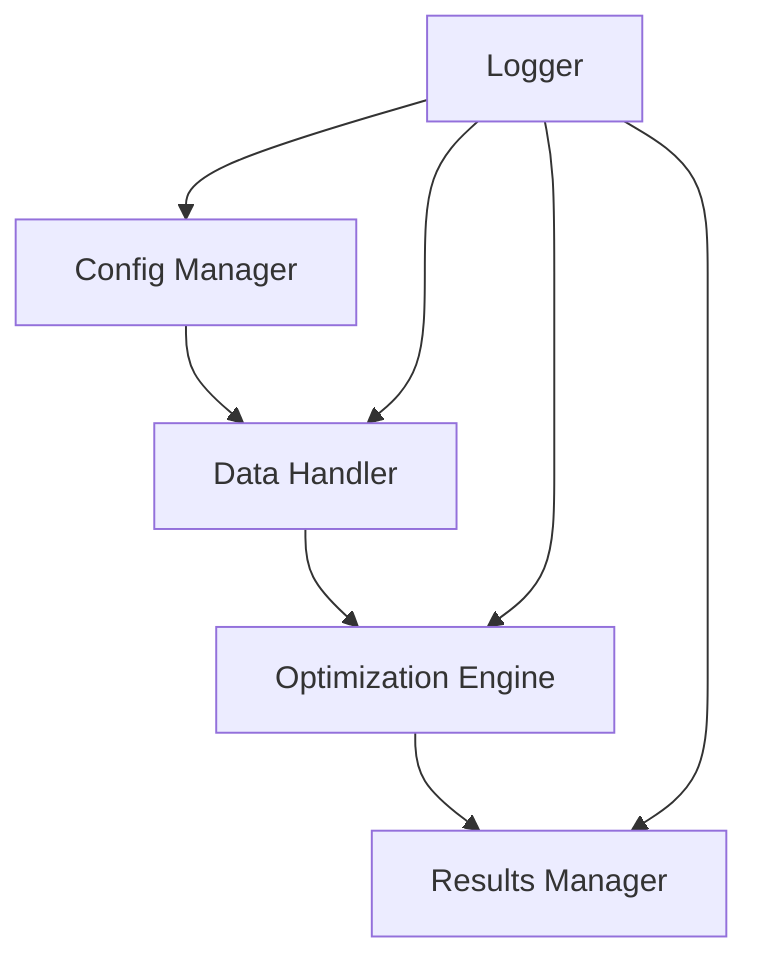
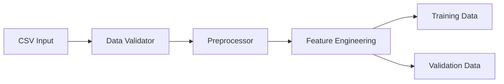
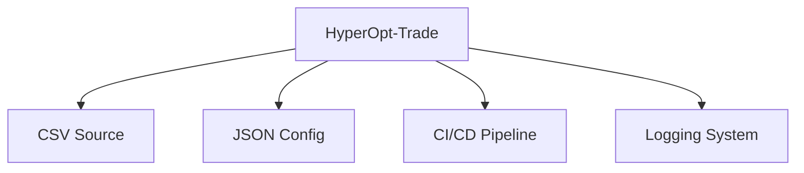
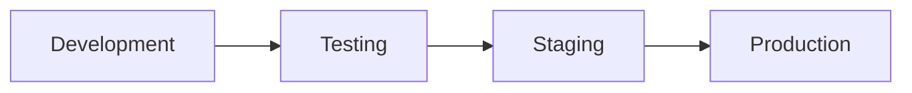

# HyperOpt-Trade System Architecture Document

## 1. System Overview

### High-Level Architecture


### Core Components
1. Configuration Manager
2. Data Handler
3. Optimization Engine
4. Results Manager
5. Logging System

### System Flow
1. Load configuration from JSON
2. Validate and preprocess data from CSV
3. Execute optimization process
4. Generate and store results
5. Log all operations

## 2. Component Architecture

### Configuration Manager
```python
class ConfigManager:
    - load_config()
    - validate_config()
    - get_parameter_space()
    - get_optimization_settings()
```

### Data Handler
```python
class DataHandler:
    - load_data()
    - validate_data()
    - preprocess_data()
    - get_training_data()
    - get_validation_data()
```

### Optimization Engine
```python
class OptimizationEngine:
    - initialize_optimizer()
    - define_objective()
    - run_optimization()
    - evaluate_parameters()
    - store_results()
```

### Results Manager
```python
class ResultsManager:
    - collect_results()
    - format_results()
    - save_results()
    - generate_reports()
```

## 3. Technical Stack

### Core Technologies
- Python 3.8+
- pandas (data handling)
- numpy (numerical operations)
- optuna (optimization framework)
- pytest (testing)
- logging (system logging)

### Development Tools
- Git (version control)
- Black (code formatting)
- pylint (code analysis)
- mypy (type checking)
- pytest-cov (code coverage)

### Dependencies
Some suggestions for dependencies:

```plaintext
requirements.txt:
pandas>=1.5.0
numpy>=1.21.0
optuna>=3.0.0
pytest>=7.0.0
pytest-cov>=3.0.0
black>=22.0.0
pylint>=2.15.0
mypy>=1.0.0
```

## 4. Data Architecture

### Data Flow


### Data Structures
```python
# Configuration Schema
{
    "strategy_name": str,
    "parameters": {
        "param_name": {
            "type": str,
            "range": [min, max],
            "step": float
        }
    },
    "optimization": {
        "method": str,
        "trials": int,
        "timeout": int
    }
}

# Results Schema
{
    "best_parameters": dict,
    "performance_metrics": dict,
    "optimization_history": list,
    "metadata": dict
}
```

## 5. Integration Architecture

### External Interfaces
1. CSV Data Source
2. JSON Configuration
3. CI/CD Pipeline
4. Logging System

### Integration Points


## 6. Deployment Architecture

### Deployment Flow


### Environment Setup
```yaml
environments:
  development:
    python_version: "3.8"
    dependencies: "requirements-dev.txt"
    
  testing:
    python_version: "3.8"
    dependencies: "requirements-test.txt"
    
  production:
    python_version: "3.8"
    dependencies: "requirements.txt"
```

## 7. Security Architecture

### Security Measures
1. Input Validation
   - JSON schema validation
   - CSV data validation
   - Parameter range checks

2. Error Handling
   - Exception handling
   - Error logging
   - Graceful degradation

3. Data Protection
   - File permissions
   - Configuration encryption
   - Secure logging

## 8. Performance Architecture

### Optimization Strategies
1. Parallel Processing
```python
class ParallelOptimizer:
    - num_workers: int
    - batch_size: int
    - initialize_workers()
    - distribute_workload()
    - collect_results()
```

2. Memory Management
```python
class MemoryManager:
    - max_memory: int
    - cleanup_threshold: float
    - monitor_usage()
    - optimize_memory()
```

### Performance Metrics
1. Execution Time
   - Optimization runtime
   - Data loading time
   - Results generation time

2. Resource Usage
   - CPU utilization
   - Memory consumption
   - Disk I/O

## 9. Development Architecture

### Development Workflow
1. Feature Development


2. Testing Strategy
```python
# Test Structure
tests/
    ├── unit/
    │   ├── test_config.py
    │   ├── test_data.py
    │   └── test_optimizer.py
    ├── integration/
    │   ├── test_pipeline.py
    │   └── test_results.py
    └── performance/
        └── test_optimization.py
```

### Code Organization
```plaintext
src/
├── config/
│   ├── __init__.py
│   └── config_manager.py
├── data/
│   ├── __init__.py
│   └── data_handler.py
├── optimization/
│   ├── __init__.py
│   └── optimizer.py
├── results/
│   ├── __init__.py
│   └── results_manager.py
└── utils/
    ├── __init__.py
    ├── logger.py
    └── validators.py
```

### Development Standards
1. Code Style
   - PEP 8 compliance
   - Type hints
   - Documentation strings

2. Version Control
   - Feature branches
   - Semantic versioning
   - Commit conventions

3. Documentation
   - API documentation
   - Architecture updates
   - Change logs

This architecture provides a robust foundation for the hyperparameter optimization pipeline while maintaining modularity, scalability, and maintainability. The system is designed to handle various trading strategies efficiently while providing clear integration points with the existing CI/CD pipeline.